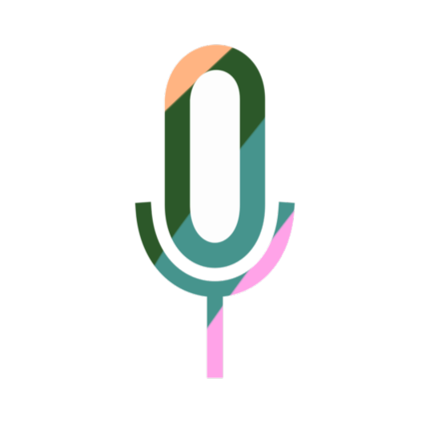
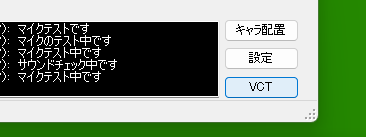
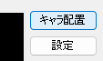

<br>

## 代読くん  
Webからローカルの音声合成ソフトに発話させられる+大体リアルタイムに実況配信が音声合成ソフトの声でできちゃうAPIエンドポイント提供ソフトです。  
簡単に言うと有償音声合成ソフト **A.I.VOICEをブラウザーから操作**できたり、これを応用して**A.I.VOICEで実況配信が即席でできたりする**ソフトです。  
Web開発者さんと動画制作者さんのどちらも使えるツールにしました(つもりです)。  
  
### 目次
- [主な機能](#主な機能features)  
- [実況に使いたい方向けガイド](#実況に使いたい方向けガイド)  
- [Webサイトで使いたい方向けガイド](#webサイトで使いたい方向けガイド)  
- [権利表記・謝辞](#権利表記謝辞)  
- [**免責事項(必ずお読みください!)**](#免責事項)  


### 主な機能/Features  
- [開発者向け] A.I.VOICEをブラウザーから読み上げを行わせるローカルホストなAPIエンドポイントの提供  
- [開発者向け] ご自身のサイトに組み込んですぐに使えるスクリプトを同梱(dec.js)  
- [ユーザー向け] すぐにキャラクターの声を使った配信ができるツール"[VoiceConTool](https://yokonoha.github.io/voicecontool)"を別途用意  
- [ユーザー向け] 自動瞬き・口パクに対応した透過立ち絵ウィンドウ機能(デスクトップ画面上に即席で立ち絵を展開)  
- [ユーザー向け] 結月ゆかりデフォルト立ち絵設定済み(横茶横葉 作)[ご利用時は[キャラクター権利元](https://vocalomakets.com/guidelines)の規約に必ず従ってください]  
- [ユーザー向け] カスタム立ち絵のロード・セットが可能(指定の画像差分4枚が別途必要)  
- [ユーザー向け] OBS等でも活用できる即席字幕表示機能(ウィンドウキャプチャで利用可)  
- [ユーザー向け] マルチモニター・100%以外の画面解像度に対応  
- [どうでもいい機能] 手動で文字を打ち込んで読み上げをさせる機能(一応付けました)   
- [どうでもいい機能] 横茶横葉の**未公開**ブラウザーソフト"ReCaffeine"との連携機能対応(ReCaf Pipeline Extension)  

### 実況に使いたい方向けガイド  
#### 1 はじめに...
当ソフトを配信に使いたいときは、別Webアプリ「VoiceConTool」を併用する必要があります。  
VoiceConToolは音声認識を担当する専用のWebアプリです。  
  
当ソフト右下にあるVCTボタンを押せばVoiceConToolを起動できます。  
#### 2 使ってみましょう!  
まずは代読くんを[ダウンロード](https://github.com/yokonoha/daidoku_kun/releases)です! 新しいバージョンを選んでくださいね。  

次に代読くんのzipファイルの中身をそのまま全部解凍してexeファイルを起動しましょう。(エラーが出て起動しない場合は、対応ボイス製品のインストールができていないor解凍時にdllファイルなどの配置を誤ったのいずれかが多いです。)  
  
出来ましたら今度はキャラ配置ボタンを押してみましょう。  
初回はゆかりさんが出てくるかと思います。(キャラの変更方法は後述)  
そうしたら、お使いのPCにマイクが内蔵or外付けしてあることを確認し、VoiceConToolを動かしてみましょう。  
  
↑VCTボタンを押してください!  

これで準備は完了です。  
  
こんな感じで5つのウィンドウが開いていればOKです。
1. 代読くん本体
1. 字幕ウィンドウ[勝手に出てくる]
1. 対応ボイスソフト[インストールされていれば勝手に起動する]
1. 立ち絵ウィンドウ[既定はゆかりさん。画像はカスタム立ち絵キットを使用]
1. VoiceConTool[ブラウザーで表示]  

### 3 はじめましょう!  
では、実際に使ってみましょう!  
VoiceConToolの"マイクをオン"ボタンを押してなにかマイクに向かって話してみてください!  
正常に動作すれば自分の話した言葉をオウム返しで喋ってくれるはずです!  

### 4 カスタム立ち絵の利用
既定の立ち絵以外にもお好みの立ち絵を設定できます。  
代読くんのexeファイルがあるところに「tachie」という名前のフォルダを作り、その中に  
- a.png  
- b.png  
- c.png  
- d.png  

の4ファイルを保存します。(この段階でお気付きの方もいらっしゃるかもしれませんが... PSD非対応ですすみません。)  
立ち絵がPSDで配布されている場合はイラストソフトでpngとしてエクスポートしてください。  
それで、各ファイルですが、以下のような内容にしてください!  
- a.png
目:開いている状態 口:開いている状態(開け開け)
- b.png
目:閉じている状態 口:開いている状態(口だけ開け)
- c.png
目:開いている状態 口: 閉じている状態(目だけ開け)
- d.png
目:閉じている状態 口:閉じている状態(閉じ閉じ)


このような構成になっていればOK! (間違えてもソフトが壊れることはないですが正しく表示されません...)  

そして最後に! 設定メニューから"カスタム立ち絵をセット"を押して登録完了メッセージが出れば完了です!!!  
お好きな立ち絵でお試しください! (※ほかの方の立ち絵をお使いになられる場合はその方の定める規約やルールに従ってください!)

### 5 FAQ
Q: 認識精度が悪い  
A:Chromeを使いましょう!色々試した中では一番精度がよかったブラウザーです。(優秀)  

Q:これ声はどこで処理されてるの?  
A:音声認識エンジンは完全にブラウザー依存です。ほとんどの場合はブラウザー開発元のサーバーに音声が送られて処理されているようです。プライバシー的にちょっと...という方はご利用をお控えください...(ブラウザー開発企業さんに関する話になっちゃうので私にもわかりません...)  

Q:VoiceConTool(以下VCT)が動かない  
A:マイクは正しく接続されていますか? 複数台接続しているときは設定アプリで選んであげる必要があります。また、ドライバーが当たってないなんてことも稀にあります。ご確認ください。  

Q:起動時に赤いXマークと一緒に詳細,続行,終了という変な表示が出て正常に動作しない  
A:それはエラーです。同梱されているdllファイルは解凍時にディレクトリ構造を保ったまま一緒にコピーしてあげてください。また、対応製品が入ってない時も表示されます。  

Q:毎回ウィンドウの準備が面倒。もっと簡単にできない?  
A:一発起動設定をしちゃいましょう。設定画面にて"起動時に連携ソフトの確認表示をしない","キャラ表示を同時起動","VCTを同時起動"のチェックボックスをすべてONにしてみてください。次回から代読くんを起動すると勝手に配信に必要なウィンドウを開いてくれるはずです。  

### 6 おまけ。
↓Tips! 分かる方向けの仕組み図解  
  
こんな感じで動いてます。  
localhostなのでブラウザーから操作できます!  
気になった方は次のセクションもご覧ください。


### Webサイトで使いたい方向けガイド  
  
いろいろごちゃごちゃと書いてますが、結局はこんな感じの結構お恥ずかしいぐらい簡単な仕組みです。(まったく凝ってないです...)  

当ソフトは付属のスクリプトdec.jsを使うと(使わなくても)簡単にご自身のサイトと連携できます。  
```dec.js
//中身(超シンプルです)
       async function send2d(recievedtext) {
            const endpointurl=`http://localhost:8080/?text=${encodeURIComponent(recievedtext)}`;
            try{
                const res=await fetch(endpointurl);
                if(res.ok){console.log("送信済み:",recievedtext);}
            }
            catch(err){console.log("サーバーと通信出来ませんでした。",err);}
        }
```
```a.html
<script src="./dec.js"></script>
```
scriptタグでhtmlにdec.jsを入れてそこでこの send2d("しゃべらせたい言葉") を書けば実装完了です! (URLエンコードもやるので普通に書いてOKです。)  
このコードを見ていただければすぐ理解できる方がほとんどかとは思いますが、8080番ポートを使います。  

...書くことはもうないので、とりあえず実践してみましょう!  
[音声解説をさせてみましょう!代読くんを起動してからここをクリックです!(音が出ます)](http://localhost:8080/?text=%E3%81%A7%E3%81%AF%E3%80%81%E3%81%93%E3%81%A1%E3%82%89%E3%81%A7%E3%81%94%E8%AA%AC%E6%98%8E%E3%81%97%E3%81%BE%E3%81%99%E3%80%82%E3%82%B9%E3%82%AF%E3%83%AA%E3%83%97%E3%83%88%E3%81%AB%E3%81%82%E3%82%8B%E9%80%9A%E3%82%8A%E3%80%818080%E7%95%AA%E3%83%9D%E3%83%BC%E3%83%88%E3%81%AB%E5%AF%BE%E3%81%97%E3%81%A6%E3%82%AF%E3%82%A8%E3%83%AAtext%E3%82%92%E8%BF%BD%E5%8A%A0%E3%81%97%E3%81%A6%E3%83%AA%E3%82%AF%E3%82%A8%E3%82%B9%E3%83%88%E3%82%92%E9%80%81%E3%81%A3%E3%81%A6%E3%81%8F%E3%81%A0%E3%81%95%E3%81%84%E3%80%82%E3%81%9D%E3%81%86%E3%81%99%E3%82%8C%E3%81%B0%E5%A4%9A%E5%88%86%E5%96%8B%E3%81%A3%E3%81%A6%E3%81%8F%E3%82%8C%E3%82%8B%E3%81%AF%E3%81%9A%E3%81%A7%E3%81%99%E3%82%88%E3%80%82)  
※dec.jsを使わず、リンクを直に設定してしまうとOKと書かれた画面が出てきてしまいますが、それでも喋ってくれます。

色々と詳しそうに書いてますが、正直私あんまり知識多いほうではないので、皆様のほうがもっとずっとうまく使いこなしていただけると思います!  

### 権利表記・謝辞  
利用させていただいた名称に対する権利表記  
A.I.VOICEは株式会社エーアイの登録商標です。  
Google ChromeはGoogle LLCの商標または登録商標です。  
"結月ゆかり"は株式会社バンピーファクトリーの登録商標です。  
その他会社名・サービス名・製品名等は各社の商標または登録商標です。  

当ソフトにはA.I.VOICE Editor API,NAudioを利用させていただきました。製作者の方々に感謝申し上げます。  

内蔵立ち絵素材(結月ゆかり): 横茶横葉(@yokocha_yokoha),Mikan  
おまけ立ち絵素材(結月ゆかり雫): 同上  
カードアート等: ららられれ(@Rarararere1)  

### 免責事項  
本ソフトウェアは個人の趣味の範囲内で製作・管理されている**非商用**のソフトウェアです。  
ご利用時には**必ず連携先合成音声ソフトの利用規約に従ってください。** 製作者は当ソフトを利用したことによって発生した紛争・損害を含む全ての問題に対して責任を負いかねますのでご注意ください。 詳しくは[横茶横葉のサイト利用規約](https://yokonoha.github.io/readme)をご参照ください。  


### おまけ。
Rev.1.0バージョンカードアート @ららられれ  
  
